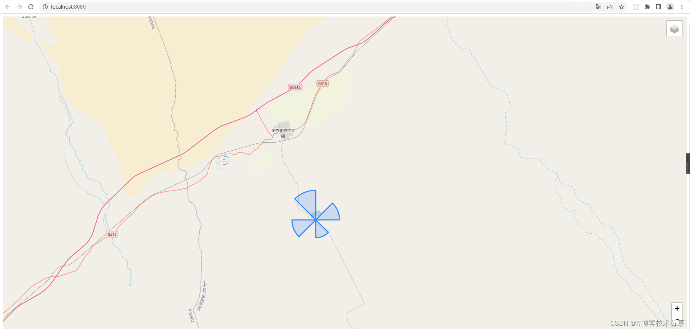
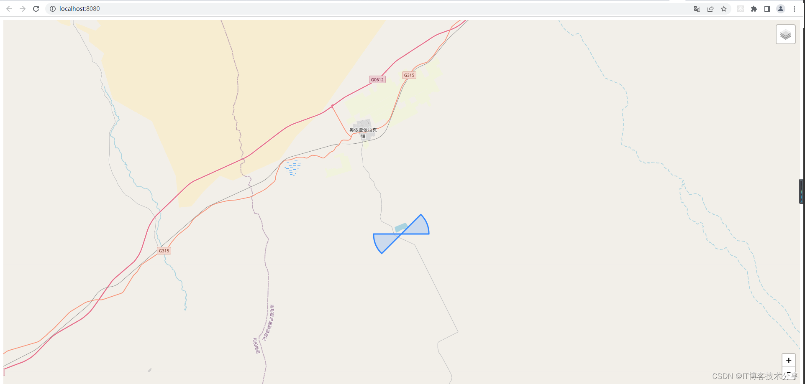

# Vue2 Leaflet.js 地图动态绘制半圆扇形

# 效果图1  （整个圆形的扇形，类似小风扇）的效果



# 效果图2 对角线扇形的效果




## Project setup
```
npm install
```

### Compiles and hot-reloads for development
```
npm run serve
```

### Compiles and minifies for production
```
npm run build
```

### Lints and fixes files
```
npm run lint
```
